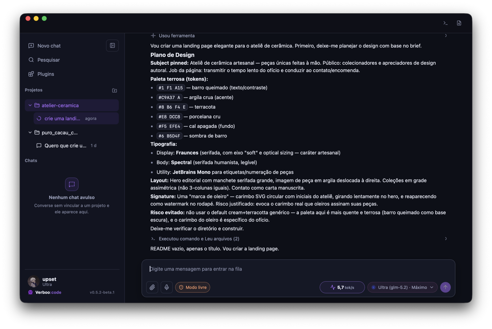
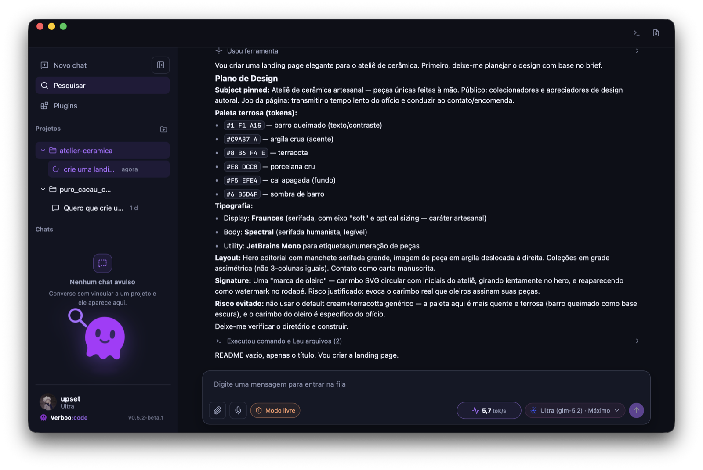
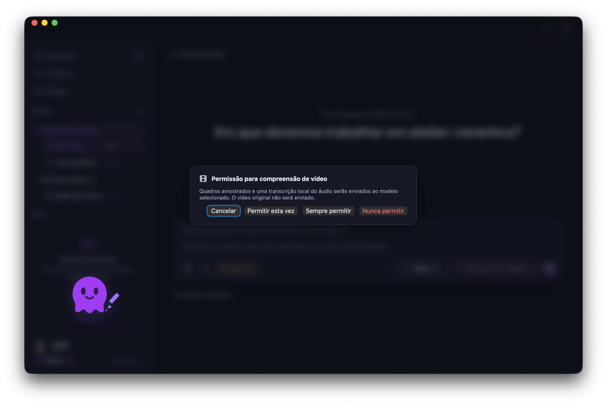

# Verboo Code Desktop

Verboo Code Desktop is a desktop client for working with the Verboo Code CLI from a focused app interface. It wraps the CLI-oriented workflow with project navigation, chat history, model selection, skill selection, permission controls, profile views, feedback reporting, and a desktop shell that runs on macOS, Windows, and Linux.

The desktop shell is built with **Tauri v2** (Rust backend + system WebView frontend). It embeds Node.js and installs the official signed CLI separately under the operating system's app-data directory.

Official CLI upstream: [verbeux-ai/code](https://github.com/verbeux-ai/code).

## Screenshots

| | |
|:---:|:---:|
|  |  |
| **Welcome** · Tela inicial<br>Start a chat or open a project in one step | **Agent at work** · Modelo trabalhando<br>Design plan, color tokens, and live command steps |
|  |  |
| **Pet** · Mascote invocável<br>Company in the sidebar while the agent works | **Video understanding** · Compreensão de vídeo<br>Explicit consent disclosing the exact route before analysis |

## Platform Support

| Platform | Architecture | Status | Installer |
|----------|--------------|--------|-----------|
| macOS | arm64 (Apple Silicon) | Stable | DMG, `.app` |
| macOS | x64 (Intel) | Beta | DMG, `.app` |
| Windows | x64 | Beta | NSIS `.exe` |
| Linux | x64 | Beta | AppImage, `.deb`, `.rpm` |

The packaged bundle ships the Rust backend, a verified Node.js 24.19.0 sidecar,
and the image/OCR dependencies it needs to start. On first launch, the app
downloads the latest compatible CLI from the official upstream release,
verifies its signed manifest and archive digest, and installs it under app-data.

For per-platform setup, known issues, and troubleshooting, see
[SETUP.md](SETUP.md).

## Project Notice

This is not an official Verboo product.

This repository is developed with authorization from the Verboo owner. Verboo, Verboo Code, the Verboo mascot, and related brand assets remain the property of their respective owners.

## What It Does

- Runs a signed, versioned Verboo CLI through an app-managed Node.js runtime.
- Detects CLI updates separately from app updates, while presenting one update card and one restart flow.
- Detects Verboo CLI authentication or a valid Verboo API key before unlocking the app.
- Lists models available to the authenticated Verboo account when possible.
- Supports model selection and per-model context-window configuration.
- Provides project and chat organization similar to coding-assistant desktop apps.
- Supports local skill discovery and multi-skill selection in the composer.
- Supports image attachment handling, including a vision-helper fallback path when the selected model does not support vision.
- Includes a local terminal side panel for project commands.
- Includes a feedback/report-bug flow backed by Supabase, with `mailto:` fallback.
- **Embedded browser panel** with multi-tab navigation, hide/restore, an 8-tab
  live cap with eviction, and a User-Agent override on macOS and Linux so web
  apps see a current browser identity. Windows (WebView2/Chromium) keeps its
  default UA, which already reports a modern identity; the Linux override is
  defensive and not yet verified on a real Linux machine.
- **Transcript annotations** — select any passage of the assistant's reply,
  capture a private comment, and send it as the next user message in turn
  order.
- **Media sidecars** — `verboo-ffmpeg`, `verboo-ffprobe`, and `verboo-whisper`
  are bundled per platform for video/audio understanding without external
  installs.
- **Chrome extension** (`extensions/verboo-chrome`, v0.3.1) — bridges the
  browser's active tab into the desktop app via native messaging.

## Requirements

- A supported desktop platform:
  - macOS 12.0 or newer (Apple Silicon arm64, Intel x64)
  - Windows 10 1809 or newer (x64)
  - Linux x64 with glibc 2.28+ (Ubuntu 20.04+, Debian 11+, Fedora 35+)
- Internet access and a valid Verboo session or API key.

Node.js, npm, Homebrew, and a global `@verboo/code` CLI are not required. On
first use, the app downloads and validates its private Node runtime under app
data; it never installs, replaces, or removes the user's system Node or global
CLI. Internet access is required for this runtime and signed CLI bootstrap; the
rest of the app remains available if bootstrap is temporarily offline.

Git is optional, but useful when the assistant works inside a real repository.

On first launch per app version, Verboo Code runs a requirements check. It
blocks only fatal package/platform problems such as a missing native sidecar.
A runtime or CLI bootstrap failure disables agent actions until a retry
succeeds, without falling back to system Node or an unverified global CLI.

See [requirements/README.md](requirements/README.md) for the full runtime
contract.

### Internal Unsigned Builds

Unsigned/ad-hoc builds are for internal testing. They can be blocked by
Gatekeeper on another Mac with messages such as "damaged" or "cannot verify the
developer". For public distribution, use Developer ID signing and notarization.

For an internal build that you trust, you can run the preflight script:

```bash
scripts/requirements/macos-arm64-preflight.sh "/Applications/Verboo Code.app"
```

If macOS quarantine is blocking a trusted internal build:

```bash
scripts/requirements/macos-arm64-preflight.sh "/Applications/Verboo Code.app" --clear-quarantine
```

## Development

```bash
npm install
npm run tauri:dev
```

Build the renderer (TypeScript check + Vite bundle):

```bash
npm run build:renderer
```

Build the full Tauri bundle (renderer + Rust + embedded runtimes):

```bash
npm run tauri:build
```

The `tauri:build` script prepares app-owned resources, builds the renderer and
verified Node/media sidecars, then runs `cargo +1.89.0 tauri build`. The app
bundle deliberately contains no CLI payload.

### GitHub Releases

Tagged releases are built and published by GitHub Actions in
`.github/workflows/tauri-release.yml`. The workflow runs a 4-target matrix and
publishes:

- macOS arm64: `.app`, `.dmg`
- macOS x64: `.app`, `.dmg`
- Windows x64: NSIS `.exe`
- Linux x64: `.AppImage`, `.deb`, `.rpm`

The Tauri updater downloads a per-release `latest.json` manifest and verifies
each update bundle against the public key in `src-tauri/tauri.conf.json`.
Separately, the CLI updater accepts only Minisign-authenticated manifests and
matching archive digests published by `verbeux-ai/code`; it can write only to
the CLI directory under app-data.

> **macOS signing status:** Release builds require Developer ID signing and are
> submitted for notarization before publication. Unsigned/ad-hoc local builds
> remain suitable only for development testing.

See [.github/workflows/tauri-release.yml](.github/workflows/tauri-release.yml)
for the active release pipeline. The app updater key and endpoints live in
[src-tauri/tauri.conf.json](src-tauri/tauri.conf.json) under `plugins.updater`;
the CLI Minisign trust root is pinned in
[src-tauri/src/services/cli_update/service.rs](src-tauri/src/services/cli_update/service.rs).

## Feedback Backend

Feedback is sent to a Supabase Edge Function when configured:

```bash
VERBOO_FEEDBACK_ENDPOINT=https://YOUR_PROJECT.supabase.co/functions/v1/feedback
VERBOO_FEEDBACK_PUBLIC_KEY=YOUR_SUPABASE_PUBLISHABLE_KEY
```

If Supabase is unavailable or not configured, the app opens a prefilled email to the maintainer.

See [CONTRIBUTING.md](CONTRIBUTING.md) for the feedback backend layout.

## Security Notes

- Do not commit real Verboo API keys.
- Do not commit Supabase service-role keys.
- API keys saved in the app are encrypted locally with the OS credential store (macOS Keychain, Windows DPAPI, Linux libsecret) via the Tauri keyring plugin.
- Feedback diagnostics intentionally avoid sending full chat transcripts.
- Full-access mode can allow broad local machine access through the underlying CLI and should be treated as a high-trust mode.

## Open Source

The application code is released under the MIT License.

The license applies to this repository's source code. It does not grant ownership or unrestricted reuse rights over Verboo trademarks, service names, logos, mascot art, or other Verboo-owned brand assets unless the Verboo owner separately grants those rights.

---

## Português (Brasil)

Verboo Code Desktop é um cliente desktop para trabalhar com o CLI do Verboo Code em uma interface focada. Ele envolve o fluxo orientado por CLI com navegação de projetos, histórico de chats, seleção de modelos, seleção de habilidades, controles de permissão, perfil, envio de feedback e uma experiência desktop amigável para macOS.

O shell desktop é construído com **Tauri v2** (backend Rust + WebView nativo do sistema), embarca o próprio Node.js e instala o CLI oficial assinado separadamente na pasta de dados do app.

CLI oficial usado como upstream: [verbeux-ai/code](https://github.com/verbeux-ai/code).

### Aviso do projeto

Este não é um produto oficial da Verboo.

Este repositório é desenvolvido com autorização do proprietário da Verboo. Verboo, Verboo Code, o mascote Verboo e os ativos de marca relacionados continuam sendo propriedade dos respectivos donos.

### O que ele faz

- Executa um CLI Verboo assinado e versionado usando o Node.js embarcado pelo app.
- Busca atualizações do CLI separadamente das atualizações do app, com um único card e um único reinício.
- Detecta autenticação do CLI Verboo ou uma chave de API Verboo válida antes de liberar o app.
- Lista os modelos disponíveis para a conta autenticada quando possível.
- Suporta seleção de modelo e configuração de janela de contexto por modelo.
- Organiza projetos e chats em uma experiência parecida com apps desktop de assistentes de código.
- Suporta descoberta local de habilidades e seleção de múltiplas habilidades no composer.
- Suporta anexos de imagem, incluindo fallback com helper vision quando o modelo selecionado não suporta visão.
- Inclui um painel lateral de terminal local para comandos do projeto.
- Inclui fluxo de feedback/reporte de bug via Supabase, com fallback para `mailto:`.
- **Painel de navegador embutido** com navegação multi-aba, esconder/restaurar,
  teto de 8 abas ativas com despejo e User-Agent próprio no macOS e no Linux,
  para que apps web vejam uma identidade de navegador atual. O Windows
  (WebView2/Chromium) mantém o UA default, que já reporta identidade moderna;
  o override do Linux é defensivo e ainda não foi verificado em máquina Linux
  real.
- **Anotações no transcript** — selecione qualquer trecho da resposta do
  assistente, capture um comentário privado e envie como a próxima mensagem
  do usuário, na ordem da conversa.
- **Sidecars de mídia** — `verboo-ffmpeg`, `verboo-ffprobe` e `verboo-whisper`
  são embarcados por plataforma para compreensão de vídeo e áudio sem
  instalação externa.
- **Extensão do Chrome** (`extensions/verboo-chrome`, v0.3.1) — conecta a aba
  ativa do navegador ao app desktop via native messaging.

### Requisitos

- macOS 12.0 ou mais recente.
- Mac Apple Silicon arm64 (build Intel x64 disponível como beta).
- Acesso à internet e uma sessão Verboo válida ou chave de API.

O bundle Tauri embarca o backend Rust e as dependências nativas do app. Node.js, npm, Homebrew e um CLI global `@verboo/code` não são necessários. Na primeira abertura, o app baixa e valida seu runtime Node privado e depois instala o CLI compatível do release oficial nos dados do app. Instalações de Node e CLI feitas pelo usuário permanecem intocadas.

Git e Apple Command Line Tools são opcionais, mas úteis quando o assistente trabalha dentro de um repositório real:

```bash
git --version
xcode-select -p
```

No primeiro início por versão do app, o Verboo Code roda uma checagem de requisitos. Ele bloqueia apenas problemas fatais de pacote/plataforma, como um sidecar nativo ausente. Uma falha de rede no bootstrap do runtime ou do CLI desabilita temporariamente as ações do agente e permite tentar novamente, sem usar o Node do sistema ou um CLI global não verificado.

Veja [requirements/README.md](requirements/README.md) para o contrato completo de runtime.

### Builds internos sem assinatura

Builds sem assinatura/ad-hoc são para testes internos. Eles podem ser bloqueados pelo Gatekeeper em outro Mac com mensagens como "damaged" ou "cannot verify the developer". Para distribuição pública, use assinatura Developer ID e notarização.

Para um build interno confiável, rode o script de preflight:

```bash
scripts/requirements/macos-arm64-preflight.sh "/Applications/Verboo Code.app"
```

Se a quarentena do macOS estiver bloqueando um build interno confiável:

```bash
scripts/requirements/macos-arm64-preflight.sh "/Applications/Verboo Code.app" --clear-quarantine
```

### Desenvolvimento

```bash
npm install
npm run tauri:dev
```

Build do renderer (checagem TypeScript + bundle Vite):

```bash
npm run build:renderer
```

Build do bundle Tauri completo (renderer + Rust + runtimes embarcados):

```bash
npm run tauri:build
```

O script `tauri:build` prepara apenas recursos pertencentes ao app, compila o
renderer e os sidecars verificados e depois roda `cargo +1.89.0 tauri build`.
O bundle do app não contém payload do CLI.

### GitHub Releases

Releases versionadas são construídas e publicadas pelo GitHub Actions em
`.github/workflows/tauri-release.yml`. O workflow roda uma matriz de 4 alvos e
publica:

- macOS arm64: `.app`, `.dmg`
- macOS x64: `.app`, `.dmg`
- Windows x64: NSIS `.exe`
- Linux x64: `.AppImage`, `.deb`, `.rpm`

O updater do Tauri baixa um manifesto `latest.json` por release e verifica cada
bundle de atualização contra a chave pública em `src-tauri/tauri.conf.json`.
Separadamente, o updater do CLI aceita apenas manifestos autenticados por
Minisign e hashes publicados pelo `verbeux-ai/code`, escrevendo somente na
pasta do CLI dentro dos dados do app.

> **Status de assinatura macOS:** Os builds de release exigem assinatura
> Developer ID e são enviados para notarização antes da publicação. Builds
> locais sem assinatura/ad-hoc continuam adequados apenas para testes de
> desenvolvimento.

Veja [.github/workflows/tauri-release.yml](.github/workflows/tauri-release.yml)
para o pipeline de release ativo. A chave e os endpoints do updater do app
ficam em [src-tauri/tauri.conf.json](src-tauri/tauri.conf.json) em
`plugins.updater`; a raiz de confiança Minisign do CLI fica fixada em
[src-tauri/src/services/cli_update/service.rs](src-tauri/src/services/cli_update/service.rs).

### Backend de feedback

O feedback é enviado para uma Supabase Edge Function quando configurado:

```bash
VERBOO_FEEDBACK_ENDPOINT=https://YOUR_PROJECT.supabase.co/functions/v1/feedback
VERBOO_FEEDBACK_PUBLIC_KEY=YOUR_SUPABASE_PUBLISHABLE_KEY
```

Se o Supabase estiver indisponível ou não configurado, o app abre um e-mail preenchido para o mantenedor.

Veja [CONTRIBUTING.md](CONTRIBUTING.md) para a estrutura do backend de feedback.

### Segurança

- Não faça commit de chaves reais da API Verboo.
- Não faça commit de chaves Supabase service-role.
- Chaves de API salvas no app são criptografadas localmente com o credential store do sistema (Keychain no macOS, DPAPI no Windows, libsecret no Linux) via o plugin Tauri keyring.
- Diagnósticos de feedback evitam enviar o transcript completo do chat.
- Modo livre pode permitir acesso amplo à máquina local através do CLI subjacente e deve ser tratado como modo de alta confiança.

### Open source

O código do aplicativo é distribuído sob a licença MIT.

A licença se aplica ao código-fonte deste repositório. Ela não concede propriedade nem direitos irrestritos de reutilização sobre marcas, nomes de serviço, logos, arte do mascote ou outros ativos de marca pertencentes à Verboo, exceto quando o dono da Verboo conceder esses direitos separadamente.
